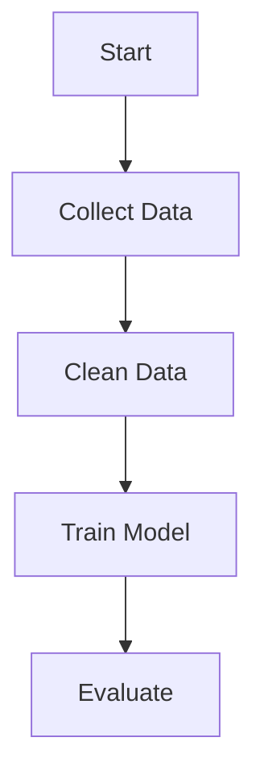

# BIOENG-2390 Spring 2026 - Lecture 15
## March 3, 2026 (Tuesday)

**Instructor:** Professor Prahlad G. Menon, PhD, PMP  
**Recording:** Zoom AI Transcript Available  
**Duration:** ~60 minutes (Project Planning Session)

---

## 📋 Lecture Overview

This lecture was dedicated entirely to **project planning and team consultations**. Each team presented their project ideas and received detailed feedback from Professor Menon on:
- Dataset selection and accessibility
- Project scope and feasibility
- Specific aims development
- Technical challenges and solutions
- Timeline and deliverables

**Format:** Individual team discussions with real-time feedback and planning

**Key Administrative Items:**
- Assignment 4 (Project Proposal) details clarified
- Agile methodology and Kanban board requirements
- Mermaid flowchart introduction
- Professor's new AI library (soul.py) demo

---

## 🎯 Main Topics

### Part 1: Agile Methodology & Project Structure (0:00-20:00)
- Epics, user stories, and tasks explained
- Specific aims as user stories
- Project proposal structure (crisis → hypothesis → aims)
- Kanban board organization

### Part 2: Team 1 - Sepsis Classification (20:00-35:00)
- **Team:** CJ Shores & Carter Jones
- **Dataset:** MIMIC-IV and eICU
- **Focus:** Single-center vs multi-center model generalization

### Part 3: Team 2 - PPG/ECG Heart Failure Prediction (35:00-48:00)
- **Team:** Dibyasankha Kundu & Anurag Kulkarni
- **Dataset:** MIMIC-3, BIDMC, CAPNObase
- **Focus:** PPG/ECG-based NYHA classification

### Part 4: Team 3 - EEG Attention Detection (48:00-55:00)
- **Team:** Michael Christofidis, Kyle Thrush, Shaaz Nadeem, Aakash Kottakota
- **Dataset:** EEGET-ALS
- **Focus:** Attention state classification from EEG

### Part 5: Team 4 - Brain Aneurysm Detection (55:00-62:00)
- **Team:** Dallas B, Laura Claytor, Yuanzhe Huang, Lingyun Wang
- **Dataset:** Kaggle RSNA + MONAI
- **Focus:** MRA-based aneurysm classification

### Part 6: Team 5 - SEEG Seizure Onset Zone (62:00-75:00)
- **Team:** Jingxiao Sun & Michael Edwards
- **Dataset:** Lab data (private) → Neuromatch (alternative)
- **Focus:** Seizure onset zone identification

### Part 7: Tools & Resources (75:00-end)
- soul.py AI library demo
- Mermaid flowchart generation
- Assignment 4 requirements

---

## 📝 Detailed Notes

## 1. Agile Methodology for Projects

### 1.1 Project Structure Overview

**Professor's Framework:**
> "We're going to try to follow the Agile methodology and define epics, user stories, and tasks. Specific aims in a scientific context are tantamount to user stories."

**Key Components:**
1. **Epic:** Overall project goal
2. **User Stories:** Specific aims (sequential)
3. **Tasks:** Individual work items under each aim

**Project Proposal Structure:**
```
1. Crisis/Problem Statement
2. Hypothesis
3. Specific Aim 1
   - Task 1.1
   - Task 1.2
4. Specific Aim 2
   - Task 2.1
   - Task 2.2
5. Expected Results
```

### 1.2 Standard Project Pipeline

**Universal Steps (All Projects):**
1. **Data Collection**
   - Download datasets
   - Verify accessibility
   - Sample appropriately

2. **Data Wrangling**
   - Clean data
   - Standardize formats
   - Handle missing values
   - Create model-ready dataset

3. **Feature Engineering**
   - Extract features
   - Dimensionality reduction
   - Normalization/scaling

4. **Modeling**
   - Train models
   - Compare approaches
   - Optimize hyperparameters

5. **Analysis & Interpretation**
   - Evaluate performance
   - Interpret results
   - Draw conclusions

6. **Reporting**
   - Create visualizations
   - Write report
   - Prepare presentation

---

## 2. Team 1: Sepsis Classification (CJ & Carter)

### 2.1 Project Overview

**Original Idea:**
- Anesthesiologist consultation about alarm fatigue
- Early warning system for ICU patients
- Prediction model for sepsis/decompensation events

**Refined Focus:**
> "Can a single center dataset be used to predict multi-center outcomes?"

### 2.2 Datasets Identified

**MIMIC-IV:**
- Medical Information Mart for Intensive Care
- **Source:** Beth Israel Medical Center (MIT)
- **Size:** 300,000 ICU admissions (2008-2019)
- **Single-center** data
- Professor has access

**Features Available:**
- Heart rate, blood pressure, respiratory rate
- Temperature, SpO2 (oxygen saturation)
- Lab values: WBC, lactate, creatinine, bilirubin, platelets
- Clinical scores: SOFA (Sequential Organ Failure)
- SIRS (Systemic Inflammatory Response Syndrome)
- Demographics: age, gender, comorbidities

**eICU:**
- **Multi-center** dataset
- **Size:** 200,000 ICU admissions from 200 hospitals
- Available on PhysioNet
- May require credentials (professor can help)

### 2.3 Professor's Hypothesis Suggestion

**Research Question:**
> "Can a model trained on single-center data (MIMIC-IV) generalize to multi-center data (eICU), or does multi-center training data produce more generalizable models?"

**Methodology:**
1. **Identify overlapping features** between MIMIC-IV and eICU
2. **Standardize units** and naming conventions
3. **Train Model A** on MIMIC-IV → Test on MIMIC-IV and eICU
4. **Train Model B** on eICU → Test on eICU and MIMIC-IV
5. **Compare performance** to determine generalization

**Expected Insight:**
- Addresses overfitting concepts from class
- Tests generalization across different hospital systems
- Practical clinical relevance

### 2.4 Specific Aims Structure

**Aim 1:** Feature Engineering & Data Preparation
- Download MIMIC-IV and eICU samples
- Examine overlapping features
- Standardize units and column names
- Create unified feature space

**Aim 2:** Model Development
- Build baseline models (e.g., XGBoost)
- Train on single-center data
- Train on multi-center data
- Cross-dataset validation

**Aim 3:** Performance Comparison
- Evaluate with AUC, sensitivity, precision
- Compare single-center vs multi-center generalization
- Analyze failure modes
- Draw clinical conclusions

**Student Question (Carter):**
> "If features have different units, is it appropriate to change the scale?"

**Professor's Answer:**
> "Just make sure each dataset has the same column name and transform both into a standard unit (e.g., centimeters). That's feature engineering."

---

## 3. Team 2: PPG/ECG Heart Failure (DK & Anurag)

### 3.1 Original Plan

**Goal:** Estimate blood pressure (SBP/DBP) from PPG signals

**Pivot During Discussion:**
> "I want to change to heart failure classification using PPG/ECG data"

### 3.2 Heart Failure Classification

**Target:** NYHA (New York Heart Association) Classification
- **Class I:** Asymptomatic
- **Class II:** Slight limitation
- **Class III:** Marked limitation
- **Class IV:** Severe limitation

**Challenge:** Finding datasets with both signal data AND NYHA labels

### 3.3 Datasets Discussed

**MIMIC-3 Waveform Database:**
- Has PPG signals (125 Hz sampling rate)
- Has clinical data with heart failure diagnoses
- **Problem:** Matching waveform IDs to clinical IDs is "a jungle"
- Requires significant data wrangling effort

**BIDMC Congestive Heart Failure Database (CHFDB):**
- Available on PhysioNet
- **15 patients** with severe CHF
- Long recordings (20+ hours each)
- Has ECG and respiration (not PPG)
- All patients have CHF (single class problem)

**CAPNObase Dataset:**
- capnobase.org
- Has PPG and clinical data
- Never used by professor before
- Worth exploring

### 3.4 Signal Processing Requirements

**Critical Considerations:**

**1. Resampling:**
> "You will 100% have to do this. Every dataset from different labs will have different sampling rates."

**Methods:**
- Time domain interpolation
- Fourier domain reconstruction (better)
- Maintain same physical time duration

**2. Signal Segmentation:**
> "Take signals of the same units of time - 5 second signals, or 5 minute signals. Create artificial patient sampling."

**Example:**
- Instead of 20 patients × 10 hours each
- Create 20 patients × many 1-minute segments
- Artificially boost dataset size

**3. Standardization:**
- Ensure all signals same length
- Same sampling rate
- Same quantization

### 3.5 Recommended Approach

**Aim 1:** Data Collection & Preparation
- Sample from multiple datasets
- Resample to common frequency
- Segment into fixed-length windows
- Verify data quality

**Aim 2:** Feature Extraction
- Frequency domain features (from class experience)
- Time domain statistics
- Heart rate variability metrics
- Create model-ready dataset

**Aim 3:** Classification Model
- Train regression or classification model
- Predict NYHA class or continuous score
- Evaluate performance
- Compare ECG vs PPG performance

**Professor's Suggestion:**
> "Even if you want to try PPG, ECG-based prediction of heart failure is very interesting and novel. My former PhD student's entire thesis was using ECG for predicting flow-limiting heart disease."

---

## 4. Team 3: EEG Attention Detection (Michael's Team)

### 4.1 Project Summary

**Dataset:** EEGET-ALS (EEG + Eye-Tracking for ALS patients)
- Eye-tracking data with gaze coordinates
- EEG recordings synchronized with eye movements
- Task: Gaze-based typing/spelling system

**Hypothesis:**
> "EEG spectral features extracted from time windows aligned with eye-tracking events will differ between attention (active key selection) and inattention periods."

### 4.2 Methodology

**Aim 1:** Generate Attention Labels
- Align gaze and typing events from ET.csv with EEG timestamps
- Identify periods of active key selection (attention)
- Label time windows as attention vs inattention

**Aim 2:** Feature Extraction & Analysis
- Extract spectral EEG features from labeled windows
- Apply PCA to analyze attention vs inattention patterns
- Visualize differences

**Aim 3:** Classification Model
- Train SVM or logistic regression
- Predict attention states from EEG features
- Evaluate with accuracy, precision, F1, sensitivity, specificity

### 4.3 Data Verification Issue

**Problem Encountered:**
- Someone accidentally overwrote their project description in Google Sheet
- Dataset link was replaced with biomechanics/gait data

**Resolution:**
> "Everybody in class, do a Ctrl-Z. Keep a local copy of your text!"

**Professor's Advice:**
- Save project descriptions locally
- Google Sheets allows collaborative editing but needs caution
- Team already had Kanban board set up (sent ~1.5 weeks prior)

### 4.4 Data Accessibility

**Student (Akash) Feedback:**
> "We can make it similar to the one from class" (referring to EEG seizure analysis)

**Professor's Response:**
> "You want to make sure it's analyzable with some TLC - examining the data, standardizing, resampling, time axis standardization, snipping to fixed lengths."

**Next Steps:**
- Verify dataset download works
- Extract sample data
- Ensure EEG and eye-tracking sync is feasible
- Prepare one visualization/slide for Thursday

---

## 5. Team 4: Brain Aneurysm Detection (Laura's Team)

### 5.1 Project Overview

**Goal:** MRA-based aneurysm detection using supervised anomaly detection

**Challenge:** 3D Medical Imaging
- MRA (Magnetic Resonance Angiography) of head
- Large file sizes (256×256×256 voxels or larger)
- Requires special libraries for 3D visualization

### 5.2 Datasets

**Kaggle RSNA Dataset:**
- Intracranial Aneurysm Detection AI Challenge
- ~1,000 images with aneurysms
- ~1,000 images without aneurysms
- Both MRA and CTA (CT Angiography)
- Includes location information
- **Problem:** ~200GB file size!

**MONAI:**
- Medical Open Network for AI
- Has aneurysm datasets
- Framework for 3D medical imaging

### 5.3 Technical Considerations

**3D vs 2D Analysis:**

**Professor's Question:**
> "Are you planning to do this analysis in 3D or 2D?"

**3D Approach:**
- More complicated
- Requires vision transformers or 3D CNNs
- May need Colab Pro for compute resources
- More authentic to clinical problem

**2D Approach (Recommended for Class):**
- Analyze horizontal slices
- One or two MRAs provide many slices
- Some slices with aneurysm, some without
- Binary classification: aneurysm present/absent
- Simpler, more feasible for course timeline

**Professor's Recommendation:**
> "If you resize the image into a standard size X by Y by Z, send it into MONAI, train a 3D CNN, it has to come back with yes or no - aneurysm present or absent. That's more than sufficient for this class."

### 5.4 Project Scope Advice

**Complex Tasks (Optional, Stretch Goals):**
- Vessel segmentation (very hard)
- Aneurysm localization (hard)
- 3D bounding boxes

**Core Task (Required):**
- **Binary classification:** Aneurysm present or absent
- "Make the first aim classification. That way you have a bird in hand."

**Tools Available:**
- **ParaView:** For 3D visualization (Laura familiar from previous class)
- **Frangi Vessel Filter:** For vessel enhancement
- **VMTK:** Vascular Modeling Toolkit
- **MONAI:** For 3D neural networks

**Specific Aims Suggested:**

**Aim 1:** Data Visualization & Exploration
- Load MRA data
- Visualize with ParaView
- Understand data structure
- Select slices/volumes for analysis

**Aim 2:** Image Preprocessing
- Resize to standard dimensions
- Normalize intensities
- Augmentation (if needed)
- Create model-ready dataset

**Aim 3:** Classification Model
- Train 3D CNN (or 2D CNN on slices)
- Binary classification
- Evaluate performance
- (Optional: Add vessel segmentation/localization)

**Professor to Laura:**
> "Let's try to get some datasets visualized and share some images with the class when we meet Thursday."

---

## 6. Team 5: SEEG Seizure Analysis (Jingxiao & Michael E.)

### 6.1 Project Pivot

**Original Plan:** Ultrasound-based lower back pain classification
**Student Feedback:**
> "I'm not really familiar with ultrasound images, so I want to change the aim of our project completely different - I think EEG is better."

**Professor's Response:**
> "That's fine. There are ample EEG datasets. You just got a new teammate, you guys can brainstorm."

### 6.2 Initial EEG Ideas

**Idea 1:** SEEG (Stereo-electroencephalography)
> "Use intracranial EEG to predict seizure or identify which brain regions may cause the seizure."

**Challenge:** Couldn't find public SEEG dataset with seizure labels

**Idea 2:** Sleep Stage Classification
> "Use EEG to separate sleep states."

**Issue:** Many models already exist for this

### 6.3 Professor's Dataset Suggestion

**Human Connectome Project:**
- Spatial distribution of brain events
- Functional connectivity data
- Signal data available
- Hundreds of datasets available
- May have simpler subsets

**Neuromatch Dataset (Provided to Student):**
- fMRI data from multiple subjects
- Task-based paradigms
- Spatial brain region analysis
- Includes colab notebook with examples
- Links to papers using dataset

**Dataset Components:**
1. Intro video
2. Dataset description (Google Doc)
3. Colab notebook (code examples)
4. Multiple papers using the data

**Professor's Instruction:**
> "You need to try it. Make sure all the links work. You can't just copy the notebook - you need to do something related."

### 6.4 Timeline Pressure

**Critical Issue:** Project still undefined, and spring break is coming

**Professor's Concern:**
> "I do need some semblance of what that might be by Thursday. Think about it, meet, discuss."

**Options:**
- EEG classification
- EEG regression
- fMRI spatial analysis
- Seizure-related analysis (if dataset found)

**Support Offered:**
> "If you want to meet one-on-one or with the three of us tomorrow, just email me and we'll make a time to meet."

---

## 7. Missing Teams

### Team 6: Marcel (Wheelchair Propulsion)
- Not present in class
- Project on markerless motion analysis for wheelchair use
- **Status:** Needs to check in Thursday

### Team 7: Joshua (Neural Decoding)
- Was present but left early
- Project on finger kinematics from neural activity (LINK dataset)
- **Status:** Needs to present Thursday

---

## 8. Assignment 4: Project Proposal Requirements

### 8.1 Deliverables

**Two Options:**

**Option A:** NIH-Style Specific Aims + 400-600 Word Abstract
**Option B:** NIH-Style Specific Aims + Kanban Board (Most teams choosing this)

**Professor's Clarification:**
> "In lieu of the 400-600 word abstract, I am willing to accept the Kanban board. It's one or the other."

### 8.2 Timeline

**Original Deadlines (from PDF):**
- March 11
- March 18

**Adjusted for Spring Break (March 7-14):**
- **Tuesday, March 17:** Specific aims page submitted
- **Thursday, March 5 (this week):** Preliminary ideas ready for discussion

**Professor's Expectation:**
> "On Thursday, we should have a sense for what is going to be entered in these documents. Thursday we continue with project discussion - be prepared with one picture, one slide, or one artifact you want to talk about."

### 8.3 Document Requirements

**Specific Aims Page Must Include:**
1. Crisis/problem statement
2. Hypothesis
3. Specific Aim 1 (with tasks)
4. Specific Aim 2 (with tasks)
5. (Optional) Specific Aim 3-4
6. **Flowchart or figure** visualizing workflow

**Kanban Board Must Have:**
- Backlog column
- In Progress column
- Done column
- Tasks assigned to team members
- Color-coded by type
- Link shared with professor (prm44@pitt.edu or prahlad.menon@quant.md)

---

## 9. Generative AI for Project Planning

### 9.1 Using AI to Analyze Datasets

**Professor's Technique:**
> "I will take the dataset and analyze it inside Visual Studio Code with Copilot. Asking questions to the dataset helps me determine the feasibility and complexity of the task at hand."

**Workflow:**
1. Load dataset in VS Code
2. Use Copilot or other LLM
3. Ask questions about:
   - Data structure
   - Feature availability
   - Missing values
   - Complexity
4. Determine feasibility BEFORE writing proposal

**Key Insight:**
> "LLMs will write anything you want, but you've got to make it grounded in what's really possible."

### 9.2 Generating Specific Aims with AI

**Can Use AI For:**
- Writing crisis statements
- Formulating hypotheses
- Structuring specific aims
- Creating task breakdowns

**Must Verify:**
- Dataset actually has required features
- Analysis is feasible in timeframe
- Methods are appropriate for data type
- Team has necessary skills

---

## 10. Tools Introduced

### 10.1 soul.py - AI Library Demo

**Professor's Announcement:**
> "This week, actually on Sunday, I released a new AI library which is very interesting... it got 50,000+ views and went viral on Reddit."

**What is soul.py?**
- Converts any folder/book/dataset into a chatable AI agent
- Two files + three lines of code
- Agent remembers conversation history
- Maintains memory across sessions
- Knows about you and your previous discussions

**Use Cases:**
- Create TA from course materials
- Query research papers
- Analyze documentation
- Knowledge base chatbot

**Key Features:**
1. **RAG (Retrieval Augmented Generation):**
   - Focal retrieval from specific memory sections
   - Fast for specific questions

2. **RLM (Recursive Language Modeling):**
   - Exhaustive search through entire memory
   - Sequential questioning of all memory chunks
   - For comprehensive answers

**Installation:**
```bash
pip install soleagent
```

**Repository:** [GitHub link provided in class]
- 37 stars (as of lecture)
- Docker container available
- Can fork and customize

**Professor's Example:**
- Created agent named "Darwin" for his book "Soul"
- Agent remembers all discussions
- Can answer questions about specific topics
- Retrieves relevant information from entire book

**For Students:**
> "If you ever wanted to try it, it's really useful to make a TA out of your course material, and all sorts of things like that."

### 10.2 Mermaid Flowcharts

**What is Mermaid?**
- Text-based flowchart generation
- Integrated with VS Code
- Can render in GitHub
- Works with markdown

**How to Use:**
1. Ask LLM: "Generate a mermaid chart for [your workflow]"
2. LLM produces mermaid code
3. Render in mermaid.live OR VS Code (with plugin)

**Example from Professor:**
- Clinical trial flowchart
- 134 lines of code
- Arbitrary complexity possible
- Automatically generated

**Rendering:**
```markdown

```

**Benefits for Projects:**
- Required for specific aims page
- Shows workflow visually
- Easy to modify
- Professional appearance

---

## 11. Key Takeaways & Action Items

### 11.1 Universal Project Advice

**For All Teams:**

1. **Dataset First:**
   > "Find the dataset first! Can't do project without data."

2. **Verify Accessibility:**
   - Download sample
   - Load in notebook
   - Verify features exist
   - Check file formats

3. **Scope Appropriately:**
   - "Bird in hand" approach
   - Core aim = achievable classification/regression
   - Stretch goals = optional advanced features

4. **Standard Pipeline:**
   - Data collection
   - Data wrangling → model-ready dataset
   - Feature engineering
   - Modeling
   - Analysis & interpretation
   - Reporting

5. **Save Your Work:**
   - Keep local copies of project descriptions
   - Google Sheets is collaborative but risky
   - Document everything

### 11.2 Immediate Action Items (Before Thursday)

**All Teams:**
- [ ] Finalize dataset selection
- [ ] Download and verify sample data
- [ ] Create one visualization/slide
- [ ] Draft preliminary specific aims
- [ ] Begin Kanban board setup
- [ ] Identify potential technical challenges

**Teams with Issues:**
- [ ] Team 3: Verify EEGET-ALS dataset download
- [ ] Team 5: Explore Neuromatch dataset, try colab notebook
- [ ] Team 6 & 7: Check in with professor

### 11.3 For Thursday's Class

**Each Team Should Present:**
1. **One artifact:**
   - Sample data visualization
   - Dataset screenshot
   - Preliminary flowchart
2. **Updated project description** in Google Sheet
3. **Tentative specific aims** structure
4. **Technical questions** for discussion

---

## 12. Technical Guidance by Data Type

### 12.1 Tabular Data Projects (Team 1)

**Advantages:**
- Easier to work with
- Standard ML pipelines
- Fast training
- Easy visualization

**Challenges:**
- Feature standardization across datasets
- Unit conversions
- Missing data handling
- Class imbalance

**Tools:**
- pandas, numpy
- scikit-learn
- H2O Flow (optional)

### 12.2 Signal Data Projects (Teams 2, 3, 5)

**Critical Requirements:**
- Resampling to common frequency
- Time axis standardization
- Fixed-length segments
- Amplitude normalization

**Feature Extraction:**
- Frequency domain (FFT)
- Time domain statistics
- Windowed features (from class)

**Tools:**
- scipy.signal
- numpy.fft
- Custom windowing functions

**Professor's Reminder:**
> "Every dataset from different labs will have different sampling rates. You will 100% have to resample."

### 12.3 Image Data Projects (Team 4)

**Special Considerations:**
- Large file sizes
- 3D vs 2D decision
- Visualization requirements
- Computational resources

**Preprocessing:**
- Resize to standard dimensions
- Normalization
- Augmentation (rotation, flip)

**Tools:**
- ParaView (visualization)
- MONAI (3D deep learning)
- SimpleITK or nibabel (loading medical images)

**Professor's Advice:**
> "3D images - you need to work out how to visualize them. ParaView for that."

---

## 13. Spring Break & Next Steps

### 13.1 Timeline Summary

**This Week:**
- Tuesday (Today): Initial project discussions
- Thursday (March 5): Present preliminary plans + one artifact

**Spring Break:** March 7-14
- Work on proposals (flexible)
- Verify datasets
- Begin initial analysis

**After Break:**
- Tuesday (March 17): Specific aims page DUE
- Kanban boards should be active
- Begin implementation

### 13.2 Assignment 4 Flexibility

**Professor's Approach:**
> "The document is due after spring break. But on Thursday the 5th, we should have a sense for what is going to be entered in these documents."

**Rationale:**
- Want proposals grounded in reality
- Need dataset verification first
- Avoid major pivots after break
- Time to iterate over break

---

## 14. Questions from Class

**Q: Is Assignment 4 due before or after spring break?**
**A:** Formal submission after break (March 17), but substantial progress expected before break (March 5).

**Q: Can we alter project descriptions in Google Sheet?**
**A:** Yes, but add "Old:" tag before previous version and "New:" for updated version so professor can track changes.

**Q: What if we can't find the right dataset?**
**A:** Keep local notes, discuss with professor, be ready to pivot quickly if needed. Dataset is THE priority.

**Q: How many specific aims should we have?**
**A:** 3-4 is typical. Remember: aims are like user stories, tasks go underneath.

**Q: Can we use data from our research labs?**
**A:** Yes! Private lab data is acceptable if you have permission and it's well-documented.

---

## 15. Quotes & Key Moments

### 15.1 On Dataset Priority

> "The last thing we want after we've worked very hard on making the proposal is to have to change the dataset."

> "Form your teams and find your datasets!" - Repeated emphasis

### 15.2 On Project Scope

> "Make the first aim classification. That way you have a bird in hand."

> "The goal is not to come back with statistics you can write a publication on - it's more to show that you can do something."

### 15.3 On Generalization

> "Can a single center study be used to predict multi-center outcomes? That would be beautiful - plays into overfitting, underfitting, generalization of rules."

### 15.4 On Signal Processing

> "You will 100% have to do resampling. Every dataset from different labs will have different sampling rates."

### 15.5 On Feasibility

> "LLMs will write anything you want in there, but you've got to make it grounded in what's really possible."

---

## 🔑 Final Checklist for All Teams

### Before Thursday (March 5):
- [ ] Dataset identified and sample downloaded
- [ ] Verified features match project needs
- [ ] Created one visualization or artifact
- [ ] Drafted preliminary specific aims
- [ ] Identified team member responsibilities
- [ ] Started Kanban board
- [ ] Listed technical questions/concerns

### Before Spring Break (March 7):
- [ ] Completed specific aims page draft
- [ ] Kanban board fully populated
- [ ] Flowchart created (use Mermaid!)
- [ ] All team members clear on roles
- [ ] Potential roadblocks identified

### After Spring Break (March 17):
- [ ] Final specific aims page submitted
- [ ] Kanban board link shared with professor
- [ ] Begin implementation
- [ ] Regular team meetings scheduled

---

**See you Thursday with your project artifacts!** 🚀

**Remember:** Dataset verification is THE priority before spring break!
