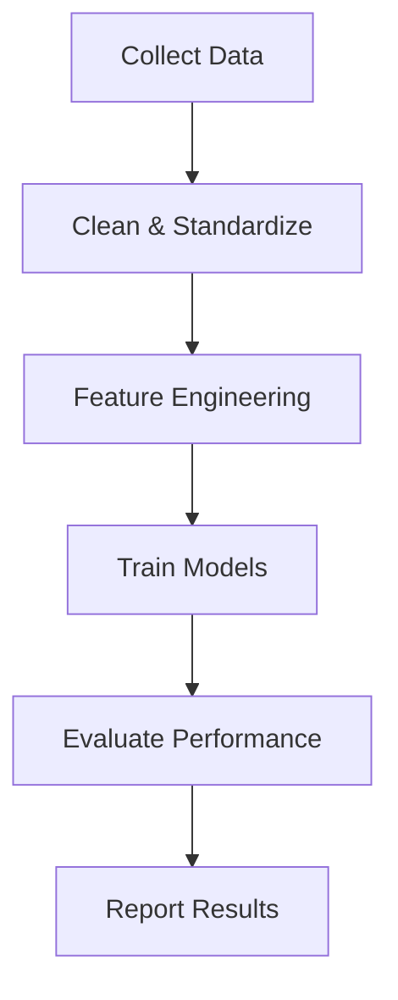

# Week 08: Project Planning & LDA Review
### BIOENG 2390: AI in Healthcare - Spring 2026

**Instructor:** Professor Prahlad G. Menon, PhD, PMP  
**University of Pittsburgh, Department of Bioengineering**

---

## 🎯 Week 08 Overview

This week transitions from technical learning to **project implementation planning**. We review Linear Discriminant Analysis (LDA) from code examples and dedicate significant class time to team consultations on final projects. Each team receives personalized feedback on dataset selection, project scope, and specific aims development.

**Key Focus:** Moving from concepts to concrete project proposals with verified datasets.

---

## 📺 Lecture Recordings & Notes

### Lecture 15 - March 3, 2026 (~60 minutes)
**Focus:** Project Team Consultations & Planning

- **Recording:** Zoom AI Transcript Available
- **[Read Detailed Lecture Notes](Lecture15_Notes_Mar03_2026.md)** ← Complete team discussions

**Topics Covered:**
- Agile methodology for scientific projects (epics → user stories → tasks)
- Individual team consultations (5 teams)
- Dataset verification and accessibility issues
- Specific aims structure and development
- Assignment 4 requirements clarified
- Tools: soul.py AI library demo, Mermaid flowcharts
- Spring break timeline planning

**Team Discussions:**

1. **Team 1 (CJ & Carter):** Sepsis classification - MIMIC-IV vs eICU generalization
2. **Team 2 (DK & Anurag):** PPG/ECG heart failure (NYHA classification)
3. **Team 3 (Michael et al.):** EEG attention detection from eye-tracking
4. **Team 4 (Laura et al.):** MRA brain aneurysm detection (3D imaging)
5. **Team 5 (Jingxiao & Michael E.):** SEEG seizure onset → Neuromatch fMRI pivot

**Key Insights:**
> "We're going to follow the Agile methodology and define epics, user stories, and tasks. Specific aims in a scientific context are tantamount to user stories."

> "The last thing we want after we've worked very hard on making the proposal is to have to change the dataset."

> "Make the first aim classification. That way you have a bird in hand."

---

### Lecture 16 - March 5, 2026 (~90 minutes)
**Focus:** Project Finalization & LDA Code Review

- **Recording:** Zoom AI Transcript Available
- **[Read Detailed Lecture Notes](Lecture16_Notes_Mar05_2026.md)** ← Finalized projects + LDA

**Topics Covered:**
- **All 7 project teams finalized** with complete hypotheses and specific aims
- LDA.ipynb notebook walkthrough (spike data example)
- LDA vs PCA vs t-SNE comparison matrix
- Multi-class logistic regression (extends beyond binary!)
- ROC curve analysis and interpretation
- Confusion matrix for multi-class problems
- LDA dimension limitation (n_classes - 1)
- Clever trick: Use t-SNE labels to train reproducible LDA
- Assignment 5 preview: MedMNIST 2D image clustering
- Spring break final preparations

**Finalized Projects:**
1. **Team 1:** Sepsis - Single vs multi-center generalization (MIMIC-IV + eICU)
2. **Team 2:** ECG Arrhythmia - 1D CNN-LSTM on MIT-BIH (pivoted from PPG)
3. **Team 3:** EEG Attention - Gaze-typing attention detection (EEGET-ALS)
4. **Team 4:** Brain Aneurysm - U-Net segmentation + demographic analysis (Kaggle RSNA)
5. **Team 5:** SEEG SOZ - Functional connectivity for seizure onset zones (lab data)
6. **Team 6:** Wheelchair Propulsion - Biomechanics (IMU/EMG)
7. **Team 7:** Finger Kinematics - Neural decoding (LINK/DANDI)

**Key LDA Insights:**
> "LDA can have max (n_classes - 1) dimensions. For binary classification, only 1 LDA component!"

> "Logistic regression generalizes to more than two classes - we've always talked about sigmoid for binary, but it works for multi-class too."

> "Can use t-SNE for initial clustering, then train LDA on original data with t-SNE labels - reproducible linear approximation of nonlinear structure!"

---

## 📁 Folder Contents

### Notebooks
- **`LDA.ipynb`** - Linear Discriminant Analysis examples
  - Using spike data from Week 6-7
  - Supervised dimensionality reduction
  - Comparison with PCA and t-SNE
  - Multi-class logistic regression
  - ROC curve analysis

### PDFs
- **`LDA.pdf`** - Linear Discriminant Analysis theory slides
  - Mathematical foundations
  - Comparison with PCA
  - When to use supervised vs unsupervised methods

### Additional Materials
- Assignment 4 shortcut (link to Google Drive)
- Project planning resources

---

## 🎯 Learning Objectives

By the end of this week, you will:

1. ✅ Understand LDA as supervised dimensionality reduction
2. ✅ Compare LDA vs PCA (supervised vs unsupervised)
3. ✅ Know when to use linear vs nonlinear methods
4. ✅ Structure scientific projects with specific aims
5. ✅ Apply Agile methodology to research projects
6. ✅ Verify dataset accessibility and feasibility
7. ✅ Create Kanban boards for project management
8. ✅ Use generative AI for project planning (with verification!)

---

## 🔬 Linear Discriminant Analysis (LDA) Summary

### Key Concepts

**What LDA Does:**
- Finds optimal directions that **maximize class separability**
- Supervised method (requires labels)
- Linear transformation (reproducible)

**LDA vs PCA:**
| Aspect | PCA | LDA |
|--------|-----|-----|
| Supervision | Unsupervised | Supervised |
| Optimizes | Variance | Class separation |
| Requires labels | No | Yes |
| Max dimensions | n_features | n_classes - 1 |
| Use case | Exploration | Classification |

**Key Limitation:**
> "For binary classification, only 1 LDA dimension possible. Number of LDA dimensions = number of classes - 1."

### Mathematical Foundation

**Goal:** Maximize separation between class means

```
Maximize: J(w) = ||μ₁ - μ₂||²
```

Where:
- μ₁, μ₂ = class means projected onto direction w
- w = optimal projection direction (what LDA solves for)

**Result:**
- Direction that best discriminates classes
- Can use as feature engineering tool
- Projects high-D data to low-D discriminative space

### Practical Implementation

**Basic Workflow:**
```python
from sklearn.discriminant_analysis import LinearDiscriminantAnalysis as LDA

# Fit LDA (supervised!)
lda = LDA(n_components=1)
X_train_lda = lda.fit_transform(X_train, y_train)  # Needs labels!

# Transform test data
X_test_lda = lda.transform(X_test)

# Train classifier on LDA features
from sklearn.linear_model import LogisticRegression
clf = LogisticRegression()
clf.fit(X_train_lda, y_train)
y_pred = clf.predict(X_test_lda)
```

**Benefits:**
- Reduces dimensionality
- Improves class separability
- Speeds up downstream classification
- Works with multi-class problems

### LDA with t-SNE Labels

**Clever Trick:**
1. Use t-SNE to find clusters (unsupervised, nonlinear)
2. Treat t-SNE cluster labels as "classes"
3. Train LDA on original data with t-SNE labels
4. **Result:** Reproducible linear approximation of nonlinear structure!

**Use Case:**
> "Can use t-SNE for initial clustering/labeling, then apply LDA on original data for reproducible classification - useful when t-SNE reveals structure but isn't practical for deployment."

---

## 📝 Project Planning Framework

### Universal Project Pipeline

**All Projects Follow:**

1. **Data Collection**
   - Download datasets
   - Verify accessibility
   - Sample appropriately (don't "boil the ocean")

2. **Data Wrangling** → Model-Ready Dataset
   - Clean data
   - Standardize formats/units
   - Handle missing values
   - Feature alignment across datasets

3. **Feature Engineering**
   - Extract domain-specific features
   - Apply dimensionality reduction
   - Normalization/scaling
   - Create new derived features

4. **Modeling**
   - Train baseline models
   - Compare multiple approaches
   - Hyperparameter optimization
   - Cross-validation

5. **Analysis & Interpretation**
   - Evaluate performance metrics
   - Interpret model behavior
   - Identify failure modes
   - Draw conclusions

6. **Reporting**
   - Visualizations
   - Written report
   - Presentation preparation

---

## 🔧 Technical Guidance by Data Type

### Signal Data (EEG, PPG, ECG)

**Critical Requirements:**
- **Resampling:** Different datasets → different sampling rates
  - Time domain interpolation
  - Fourier domain reconstruction (preferred)
- **Segmentation:** Fixed-length windows (e.g., 1-min, 5-min)
- **Artificial Sampling:** Boost dataset by sampling multiple windows per patient

**Example:**
> "20 patients × 10 hours → 20 patients × many 1-minute segments = much larger dataset"

**Feature Extraction:**
- Frequency domain (FFT - learned in class)
- Time domain statistics
- Windowed features

### Tabular Data (Clinical Records)

**Challenges:**
- Feature standardization across datasets
- Unit conversions (e.g., cm vs inches)
- Column name mapping
- Missing data handling

**Advantages:**
- Standard ML pipelines
- Fast training
- Easy to interpret
- No complex preprocessing

### Image Data (MRI, CT, X-ray)

**Considerations:**
- **3D vs 2D decision** impacts complexity
- Large file sizes (sample strategically!)
- Visualization tools (ParaView)
- Computational resources (may need Colab Pro)

**Recommended Approach:**
- Start with 2D (slices)
- Binary classification first
- Advanced tasks (segmentation) as stretch goals

---

## 📊 Finalized Project Teams

**See complete details in:** [Project Planning Spreadsheet](https://docs.google.com/spreadsheets/d/1zx0zyhs9P8LcYy8nOV064GZCjnf1McctYfpQntquJsQ/edit?pli=1&gid=1300895358#gid=1300895358)

### Team 1: Sepsis Prediction - Single vs Multi-Center Generalization
**Members:** CJ Shores, Carter Jones  
**Kanban:** [View Board](https://kanbanflow.com/board/7hNKePV)

**Hypothesis:**
> "An algorithm trained on the vast multi-center network of eICU will exhibit significantly less performance degradation on predicting sepsis upon external validation compared to a MIMIC-IV model, proving that dataset heterogeneity is beneficial for strong prediction models."

**Datasets:** MIMIC-IV (single-center) + eICU (multi-center) + VitalDB

**Methods:** XGBoost with cross-dataset validation, comparing AUC/sensitivity/average precision

---

### Team 2: ECG Arrhythmia Classification
**Members:** Dibyasankha Kundu, Anurag Kulkarni  
**Kanban:** [View Board](https://kanbanflow.com/board/VpQb3BS)

**Hypothesis:**
> "A 1D CNN-LSTM model trained on raw ECG waveform segments from the MIT-BIH Arrhythmia Database can learn distinguishing temporal features of cardiac signals and accurately classify normal and arrhythmic heartbeats."

**Dataset:** MIT-BIH Arrhythmia Database (PhysioNet)

**Methods:** 1D CNN-LSTM, binary/multi-class classification (Normal, PVC, APB)

**Note:** Pivoted from PPG heart failure to ECG arrhythmia for clearer dataset/labels

---

### Team 3: EEG-Based Attention Detection During Eye-Typed Communication
**Members:** Michael Christofidis, Kyle Thrush, Shaaz Nadeem, Aakash Kottakota  
**Kanban:** [View Board](https://kanbanflow.com/board/2LfZqFw)

**Hypothesis:**
> "EEG spectral features extracted from time windows aligned with eye-tracking events will differ between attention (active key selection) and inattention periods, allowing machine learning models to reliably classify user attention during gaze-based spelling tasks."

**Dataset:** EEGET-ALS (EEG + eye-tracking data from ALS patients/healthy controls)

**Methods:** Spectral features, PCA, Kernel SVM with 5-fold cross-validation

---

### Team 4: Intracranial Aneurysm Detection from MRA
**Members:** Dallas B, Laura Claytor, Yuanzhe Huang, Lingyun Wang  
**Kanban:** [View Board](https://kanbanflow.com/board/KK1ks6F)

**Hypothesis:**
> "Both age and sex may be associated with differences in volume or the prevalence of aneurysm location."

**Datasets:** Kaggle RSNA Aneurysm Challenge + MONAI/OpenNeuro

**Methods:** U-Net vessel segmentation, supervised learning/ensemble models, demographic analysis

**Aims:** (1) Vessel segmentation, (2) Aneurysm detection with demographic factors

---

### Team 5: SEEG-Based Seizure Onset Zone Classification  
**Members:** Jingxiao Sun, Michael Edwards  
**Kanban:** [View Board](https://kanbanflow.com/board/w2aNYWH)

**Hypothesis:**
> "There are significant differences in the strength of information connectivity between SOZ and non-SOZ brain regions, and we are able to distinguish these features and classify SOZ versus non-SOZ regions using models such as SVM or random forest."

**Dataset:** Lab SEEG data (15 epilepsy patients, 5-min sleep + awake segments)

**Methods:** Functional connectivity matrices, SVM/Random Forest for SOZ classification

**Backup:** Neuromatch fMRI dataset if lab data inaccessible

---

### Team 6: Biomechanics - Wheelchair Propulsion Analysis
**Members:** Marcel Oliart  
**Kanban:** [View Board](https://kanbanflow.com/board/VhL9bdD)

**Focus:** Gait analysis or biomechanics for optimal wheelchair propulsion

**Datasets:** Markerless Motion Analysis System, IMU/EMG sensors, TU Delft dataset

**Status:** Individual project

---

### Team 7: Decoding Finger Kinematics from Intracortical Neural Activity
**Members:** Joshua Daniel  

**Hypothesis:**
> "Applying dimensionality reduction and regression models to decode finger kinematics and evaluate generalization for neuroprosthetic control."

**Dataset:** LINK - Long Term Intracortical Neural Activity and Kinematics (DANDI Archive)

**Focus:** Neural decoding, regression for kinematics prediction, neuroprosthetic applications

**Status:** Individual project

---

## 📝 Assignment 4: Project Proposal

### Deliverables (Choose One Format)

**Option A:** Specific Aims Page + 400-600 Word Abstract  
**Option B:** Specific Aims Page + Kanban Board ← Most teams choosing this

### Specific Aims Page Requirements

**Must Include:**
1. **Crisis/Problem Statement** - Why this matters
2. **Hypothesis** - What you expect to find
3. **Specific Aim 1** - Data collection & wrangling
4. **Specific Aim 2** - Feature engineering & modeling
5. **Specific Aim 3** - Analysis & interpretation
6. **Flowchart/Figure** - Visual workflow (use Mermaid!)
7. **Expected Results** - What you hope to achieve

**Structure Example:**
```
Crisis: Sepsis detection is challenging in ICU settings
Hypothesis: Multi-center data produces more generalizable models
Aim 1: Create overlapping feature space between datasets
  - Download MIMIC-IV and eICU
  - Identify common features
  - Standardize units and formats
Aim 2: Train and validate models
  - XGBoost on single-center
  - XGBoost on multi-center
  - Cross-dataset testing
Aim 3: Compare generalization performance
  - AUC, sensitivity, precision
  - Analyze failure modes
```

### Kanban Board Requirements

**Columns:**
- Backlog
- In Progress (This Week/Sprint)
- Done

**Must Have:**
- Tasks assigned to team members
- Color-coding by type
- Reflects specific aims structure
- Shared with professor (prm44@pitt.edu)

**Example Tasks:**
- Import MIMIC-IV dataset
- Resample signals to 125Hz
- Extract frequency features
- Train logistic regression
- Create ROC curves
- Write final report

---

## 🗓️ Important Dates

### This Week
- **Tuesday (March 3):** Initial project discussions ✅
- **Thursday (March 5):** Project finalization & LDA review ✅

### Spring Break
- **March 7-14:** Work on proposals (flexible timeline)

### After Break
- **Tuesday (March 17):** Assignment 4 DUE (Specific Aims Page)
- Kanban boards must be active
- Begin project implementation

---

## 🛠️ New Tools Introduced

### soul.py - AI Agent Library

**What:** Convert any folder/book/code into a chatable AI agent  
**Features:**
- RAG (Retrieval Augmented Generation) for focal queries
- RLM (Recursive Language Modeling) for exhaustive answers
- Memory across sessions
- 2 files + 3 lines of code

**Installation:**
```bash
pip install soleagent
```

**Use Cases:**
- Create TA from course notes
- Query research documentation
- Analyze dataset documentation
- Knowledge base chatbot

**Stats:** 50,000+ views, went viral on Reddit, 37+ GitHub stars

**Professor's Example:** Created "Darwin" agent for his book "Soul"

---

### Mermaid Flowcharts

**What:** Text-based flowchart generation  
**Where:** VS Code, GitHub, mermaid.live

**How to Use:**
1. Ask LLM: "Generate mermaid chart for my project workflow"
2. Copy generated mermaid code
3. Render in VS Code (with plugin) or mermaid.live

**Example:**


**Required:** Include flowchart in specific aims page!

---

## 💡 Key Advice from Professor

### On Datasets
> "Find the dataset first! Can't do project without data."

> "The last thing we want after working hard on the proposal is to have to change the dataset."

### On Scope
> "Make the first aim classification. That way you have a bird in hand."

> "The goal is not to come back with statistics you can write a publication on - it's to show that you can do something."

### On Signal Processing
> "You will 100% have to do resampling. Every dataset from different labs will have different sampling rates."

### On AI Tools
> "LLMs will write anything you want, but you've got to make it grounded in what's really possible."

### On Generalization
> "Can a single center study be used to predict multi-center outcomes? That would be beautiful - plays into overfitting, underfitting, generalization of rules."

---

## 📚 LDA Review (from Code)

### When to Use LDA

**Use LDA when:**
- ✅ You have labeled data (supervised)
- ✅ Want to maximize class separability
- ✅ Need reproducible linear transformation
- ✅ Multi-class classification problem
- ✅ Feature engineering for downstream models

**Don't use LDA when:**
- ❌ No labels available → Use PCA or t-SNE
- ❌ Need nonlinear separation → Use t-SNE or kernel methods
- ❌ Only exploratory analysis → PCA sufficient

### LDA Limitations

**Dimension Constraint:**
```
Maximum LDA components = n_classes - 1
```

**Examples:**
- Binary classification (2 classes) → Max 1 LDA component
- 10-class problem (MNIST digits) → Max 9 LDA components

**Nature:**
- Linear method (tends to underfit rather than overfit)
- May not capture complex nonlinear boundaries
- But reproducible and interpretable!

### LDA in Pipeline

**Typical Workflow:**
```
Raw Data (high-D)
    ↓
LDA Transform (supervised)
    ↓
Reduced Data (low-D, discriminative)
    ↓
Classification Model (logistic regression, SVM, etc.)
    ↓
Predictions
```

**Benefits:**
- Faster training (fewer features)
- Better generalization (less overfitting)
- More interpretable (fewer dimensions)

---

## 🎯 Action Items for Students

### Immediate (Before Thursday, March 5)
- [ ] Download and verify sample dataset
- [ ] Create one visualization/artifact to present
- [ ] Draft preliminary specific aims structure
- [ ] Update Google Sheet with refined project description
- [ ] Identify technical challenges/questions
- [ ] Start Kanban board setup

### Before Spring Break (March 7)
- [ ] Verify dataset has all required features
- [ ] Complete specific aims page draft
- [ ] Populate Kanban board with all tasks
- [ ] Create workflow flowchart (Mermaid)
- [ ] Assign tasks to team members
- [ ] Identify any blockers

### Over Spring Break
- [ ] Work on dataset preprocessing (if accessible)
- [ ] Refine specific aims based on data exploration
- [ ] Begin literature review for crisis statement
- [ ] Plan week-by-week implementation timeline

### After Spring Break (March 17)
- [ ] Submit final Assignment 4 (Specific Aims Page)
- [ ] Share Kanban board link with professor
- [ ] Begin active project implementation
- [ ] Regular team check-ins

---

## 🔍 Dataset Resources Mentioned

### Tabular Clinical Data
- **MIMIC-IV:** 300k ICU admissions, single-center (MIT)
- **eICU:** 200k ICU admissions, 200 hospitals, multi-center

### Signal Data
- **MIMIC-3 Waveform:** PPG, ECG at 125Hz (hard to match with clinical)
- **BIDMC CHF:** 15 patients, ECG+respiration, 20hr recordings
- **CAPNObase:** PPG + clinical data (capnobase.org)
- **EEGET-ALS:** EEG + eye-tracking for ALS patients

### Image Data
- **Kaggle RSNA:** Brain aneurysm MRA/CTA (~200GB, 1k+ images)
- **MONAI:** Medical imaging datasets + 3D deep learning framework

### fMRI/Brain Data
- **Human Connectome Project:** Spatial brain analysis
- **Neuromatch:** fMRI task data with colab notebooks

---

## 🙋 FAQ

**Q: Can I use data from my research lab?**  
**A:** Yes! Private data is fine if you have permission and documentation.

**Q: What if my dataset is too large to download?**  
**A:** Sample strategically! Take 10-20 examples, not the entire 200GB.

**Q: How many specific aims should I have?**  
**A:** 3-4 is typical. Quality over quantity. Each aim should be substantial.

**Q: Can I change my project idea?**  
**A:** Yes, but do it NOW before spring break. Dataset must be verified first.

**Q: Is 3D medical imaging too hard for this class?**  
**A:** Start with 2D or binary classification. Add 3D/segmentation as stretch goals.

**Q: How do I handle different sampling rates in signal data?**  
**A:** Resample using Fourier domain reconstruction (covered in Week 6). Essential!

**Q: Can I use pre-trained models?**  
**A:** Focus should be on YOUR analysis and feature engineering. Pre-trained OK for feature extraction (e.g., transfer learning) but you must do the classification/modeling.

---

## 📖 Additional Resources

### From Professor's Lab
- **HeartIO:** ECG-based coronary artery disease detection (published JACC 2026)
- Example of ECG feature engineering for cardiac diagnosis

### Tools for Project Management
- **Kanban Flow:** kanbanflow.com (free)
- **Mermaid:** mermaid.live (flowchart rendering)
- **soul.py:** Create AI agents from your project documentation

### Visualization Tools
- **ParaView:** 3D medical image visualization
- **matplotlib/seaborn:** 2D plotting
- **plotly:** Interactive visualizations

---

## 🔑 Week 8 Key Takeaways

### 1. LDA Concepts
- ✅ Supervised dimensionality reduction maximizes class separability
- ✅ Linear method with max(n_classes - 1) components
- ✅ Reproducible alternative to t-SNE for labeled data
- ✅ Can combine with t-SNE: use t-SNE labels to train LDA
- ✅ Effective feature engineering tool

### 2. Project Planning
- ✅ Dataset verification is THE #1 priority
- ✅ Agile methodology: Epics → User Stories (aims) → Tasks
- ✅ Standard pipeline applies to all projects
- ✅ Scope conservatively: "Bird in hand" approach
- ✅ Use Kanban boards for task management

### 3. Data Processing
- ✅ **Signal data:** Must resample to common frequency
- ✅ **Tabular data:** Standardize units and features
- ✅ **Image data:** Resize to common dimensions
- ✅ Create "model-ready" dataset before modeling

### 4. Tools & Techniques
- ✅ Use AI (Copilot, ChatGPT) to explore dataset feasibility
- ✅ Mermaid for flowcharts (required in specific aims)
- ✅ soul.py for creating knowledge base chatbots
- ✅ Google Sheets for collaboration (but keep local backups!)

### 5. Timeline Management
- ✅ Thursday: Present artifacts (1 visualization/slide)
- ✅ Spring break: Work on proposals flexibly
- ✅ March 17: Final submission
- ✅ No major pivots after break!

---

## 📌 Critical Reminders

**Before Spring Break:**
> "By Thursday, we should have a sense for what is going to be entered in these documents."

**On Verification:**
> "Make sure you can do this with some samples... the best thing you can do to make sure it sounds reasonable."

**On Collaboration:**
> "Keep a local copy of your project description - Google Sheets is collaborative but risky!"

**On Scope:**
> "Don't try to boil the ocean. Just a small sample is sufficient."

---

**Next Week:** Project artifact presentations, LDA code review, final pre-break preparations

**See you Thursday with your visualizations!** 🚀
